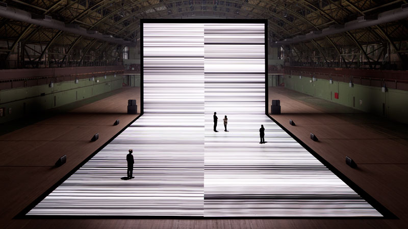
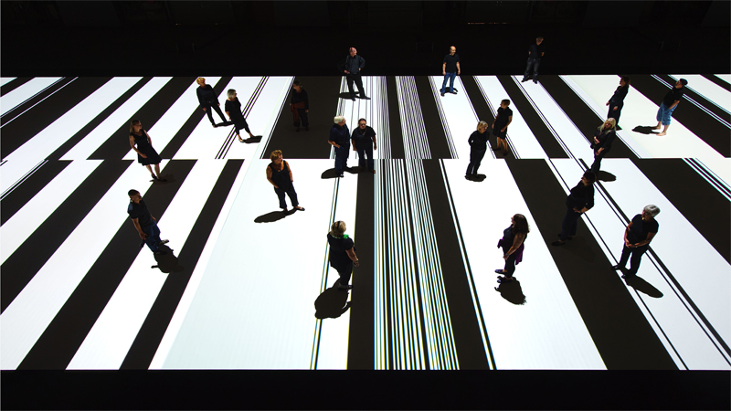
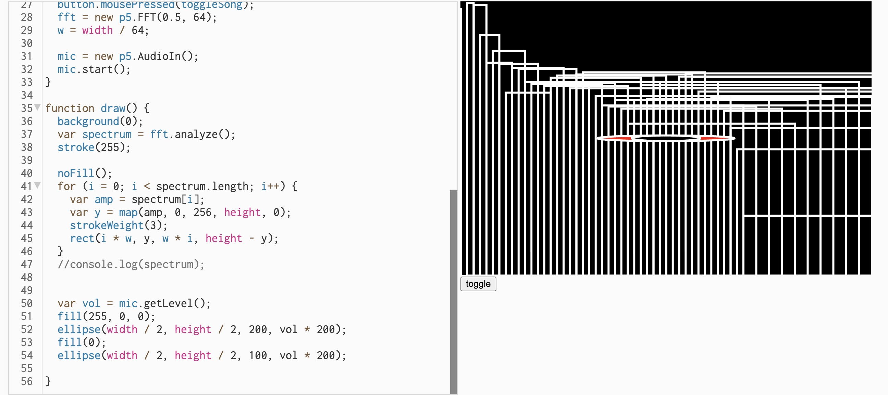

# Week 8 Quiz — Design Research

## Part 1 - Imaging Technique Inspiration: Ryoji Ikeda — *test pattern*

*Ryoji Ikeda, test pattern series — [ryojiikeda.com](https://www.ryojiikeda.com/project/testpattern/)*

---

## 1.1 Core Imaging Technique: Data-to-Barcode Transduction

The imaging principle follows a clear pipeline:

**Input → Encoding → Output**

1. **Algorithmic translation** — Any data (audio, text, image, binary stream) is translated into one-dimensional or two-dimensional barcode patterns through algorithms. Sound data drives vision simultaneously, and the visual structure directly corresponds to the audio waveform.

2. **Binary engraving** — The width, density, and rhythm of the barcode correspond to numerical changes in the data. Data is directly "engraved" into images in its lowest binary form.

3. **Stroboscopic effect** — High-speed scrolling barcodes are presented at a very high frame rate, producing a visual stroboscopic effect. The speed and frequency of image changes become part of the expressive medium itself.

> **Core inspiration: making data the rule for generating graphics.**

---

## 1.2 Application to My Project

### Why *Data-as-Image* is a beneficial technique

Ikeda's core idea is that **data is the rule of vision**. 

3 Benefits：

- **Direct audio interaction** — Sound is not only a trigger, but the source of visual content itself. This creates a stronger depth of interaction than conventional input-response mechanics.

- **Real-time, non-preset visuals** — The picture is generated in real time rather than being pre-animated. People's behavior triggers to generate completely different visual traces, which makes each interaction unique.

- **Technically achievable in p5.js** — Library functions such as `p5.FFT` and `p5.Amplitude` can directly obtain real-time audio data and map it to visual parameters.

---

## Part 2 — Coding Technique

## 2.1 Fast Fourier Transform (FFT)

FFT converts an audio signal from the **time domain** into the **frequency domain** — decomposing a complex sound into hundreds of individual frequency components, each with its own amplitude value. This produces a data array that updates in real time every frame, which can then be used to drive visual parameters directly.

### Example Implementation

> [View live sketch on p5.js Web Editor →](https://editor.p5js.org/Ruyi_Chen/sketches/H1UJM_0nQ)

## 2.2 How FFT helps achieve the desired effect

A human voice is a complex mixed signal. FFT breaks it down into hundreds of frequency components and that data array directly drives the visuals:

| Frequency Component | Visual Parameter |
|---|---|
| High low-frequency energy (deep voice) | Shapes grow larger, expand, edges blur |
| High high-frequency energy (sharp sound) | Shapes become dense, sharp, thin lines increase |
| High overall amplitude (loud voice) | Brightness increases, coverage expands |
| Silence | Visuals contract, approach zero |

This achieves the desired effect of **making the human voice visible** — each person's unique voice produces a completely different visual output in real time, not from a preset animation, but generated directly from the sound data itself.

## References

- [p5.FFT Official Documentation](https://p5js.org/reference/p5.sound/p5.FFT/)
- [The Coding Train — FFT Sound Visualization Tutorial](https://www.youtube.com/watch?v=2O3nm0Nvbi4)
- [Live Example on p5.js Web Editor](https://editor.p5js.org/Ruyi_Chen/sketches/H1UJM_0nQ)